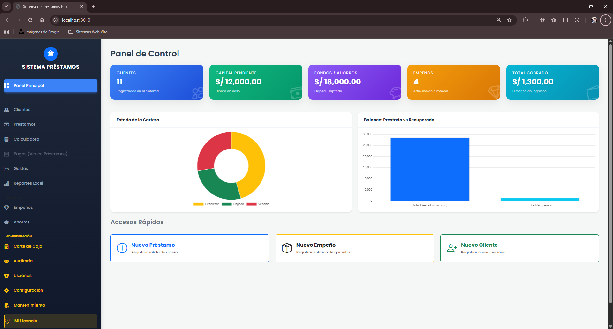

# Sistema de Préstamos y Cobranza Pro 💰

SaaS web para la gestión de **préstamos, cobranzas, cuotas, mora y empeños**, construido con **Laravel 11 + MySQL**.

Esta primera entrega incluye: **autenticación (login)**, **dashboard con gráficos**, **layout profesional** (sidebar + topbar), el **módulo de Clientes funcional (CRUD)** y todos los demás módulos enlazados en el menú.



---

## ✅ Requisitos

- PHP **8.2** o superior (con extensiones `pdo_mysql`, `mbstring`, `openssl`, `fileinfo`, `tokenizer`, `xml`, `ctype`, `json`, `bcmath`)
- [Composer](https://getcomposer.org/)
- MySQL 5.7+ / MariaDB (o MySQL en XAMPP / Laragon / WAMP)

> 💡 En Windows, **Laragon** o **XAMPP** ya traen PHP + MySQL + Composer listos.

---

## 🚀 Instalación paso a paso

Abre una terminal **dentro de la carpeta del proyecto** (`saas_prestamosycobranzas`) y ejecuta:

```bash
# 1. Instalar dependencias de Laravel
composer install

# 2. Generar la clave de la aplicación
php artisan key:generate
```

### 3. Crear la base de datos

El archivo `.env` ya viene configurado con:

```
DB_DATABASE=saas_prestamos_cobranzas
DB_USERNAME=root
DB_PASSWORD=
```

Crea la base de datos vacía (desde phpMyAdmin, HeidiSQL o consola):

```sql
CREATE DATABASE saas_prestamos_cobranzas CHARACTER SET utf8mb4 COLLATE utf8mb4_unicode_ci;
```

> Si tu MySQL tiene contraseña, edita `DB_PASSWORD` en el archivo `.env`.

### 4. Migrar y poblar con datos de ejemplo

```bash
php artisan migrate --seed
```

Esto crea todas las tablas e inserta datos de demostración (clientes, préstamos, cuotas, pagos, empeños) para que el dashboard muestre información real.

### 5. Levantar el servidor

```bash
php artisan serve
```

Abre 👉 **http://localhost:8000**

---

## 🔐 Credenciales de acceso (demo)

| Rol      | Correo                        | Contraseña |
|----------|-------------------------------|------------|
| Admin    | `admin@prestamospro.test`     | `password` |
| Cobrador | `cobrador@prestamospro.test`  | `password` |

---

## 🧩 Módulos del sistema

| Módulo            | Estado en esta entrega          |
|-------------------|---------------------------------|
| Panel Principal   | ✅ Dashboard con tarjetas y gráficos |
| Clientes          | ✅ CRUD completo + búsqueda + paginación |
| Préstamos         | 🔜 Estructura BD lista (UI en construcción) |
| Cobranzas         | 🔜 En construcción              |
| Pagos / Cuotas    | 🔜 Estructura BD lista          |
| Mora              | 🔜 En construcción              |
| Empeños           | 🔜 Estructura BD lista          |
| Reportes          | 🔜 En construcción              |
| Caja / Corte      | 🔜 En construcción              |
| Auditoría         | 🔜 En construcción              |
| Usuarios          | 🔜 En construcción              |
| Configuración     | 🔜 En construcción              |

Las tablas de `prestamos`, `cuotas`, `pagos` y `empenos` **ya están creadas y con datos**, listas para desarrollar su interfaz en la siguiente iteración.

---

## 🗂️ Estructura principal

```
app/
  Http/Controllers/   → Login, Dashboard, Clientes, Modulos
  Models/             → User, Cliente, Prestamo, Cuota, Pago, Empeno
database/
  migrations/         → tablas del sistema
  seeders/            → datos de ejemplo + usuarios
resources/views/
  layouts/app         → layout con sidebar + topbar
  auth/login          → pantalla de login
  dashboard/          → panel de control
  clientes/           → CRUD de clientes
public/css/app.css    → diseño visual
routes/web.php        → rutas
```

---

## 🛠️ Comandos útiles

```bash
php artisan migrate:fresh --seed   # Reinicia la BD con datos limpios
php artisan optimize:clear         # Limpia caché de config/rutas/vistas
```

---

## 🎨 Tecnología

- **Backend:** Laravel 11 (PHP 8.2)
- **BD:** MySQL
- **Frontend:** Blade + CSS propio + [Bootstrap Icons](https://icons.getbootstrap.com/) + [Chart.js](https://www.chartjs.org/) (vía CDN, sin necesidad de `npm`)

> No se requiere `npm install` ni compilar assets: los estilos están en `public/css/app.css` y las librerías se cargan por CDN.
